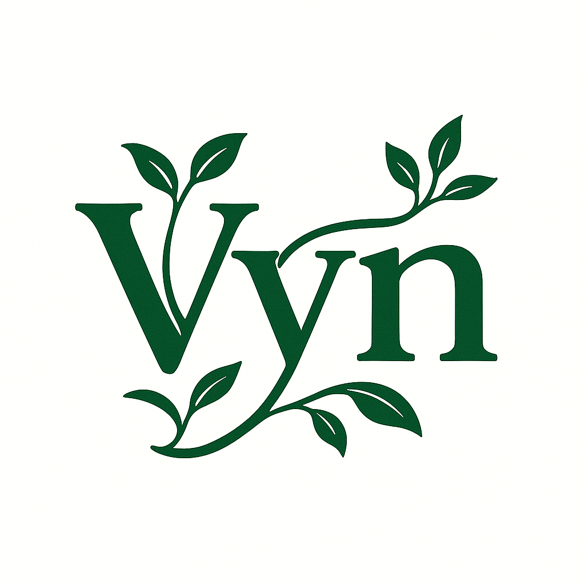

## Vyn Programming Guide

---

## 1. Introduction

Welcome to the Vyn Programming Guide. This guide walks you through writing, building, and extending Vyn programs, from your first “Hello, Vyn!” to deep dives into the Vyn language internals and runtime. Version 0.2.8 delivers a robust parser with support for advanced constructs like asynchronous programming, generic templates, operator overloading, and class declarations within templates, validated by a comprehensive test suite (15/15 tests passing).

### 1.1 Purpose & Audience

This guide is intended for systems programmers, language designers, and developers who want:

* A compact, expressive syntax for both low-level control and high-level abstractions.
* Planned fine-grained memory management options, including GC, manual free, and scoped regions.
* Built-in concurrency primitives and customizable threading templates.
* A foundation for a self-hosted compiler and hybrid VM/JIT architecture for rapid iteration and performance tuning.

Whether you’re coming from C/C++, Rust, D, or other modern systems languages, you’ll find Vyn’s template-driven approach familiar yet uniquely powerful.

Here’s a comparison of Vyn against several modern systems languages, showing key similarities and differences:

| Language | Templates / Generics               | Memory Model                                                       | Concurrency                            | Syntax Style                      | Unique Feature                                     | Comment                                                      |
| -------- | ---------------------------------- | ------------------------------------------------------------------ | -------------------------------------- | --------------------------------- | -------------------------------------------------- | ------------------------------------------------------------ |
| **Vyn**  | Monomorphized templates everywhere | Planned hybrid GC (lazy, scoped) + manual free + RC                | Async/await, planned actors, threads, channels | Indentation-based, optional braces | Planned self-hosting compiler; dual VM/JIT backend, hybrid indentation | Combines zero-cost templates with flexible memory management |
| **Rust** | Monomorphized generics             | Ownership/borrow checker; optional `Arc`/`Rc`                      | `async`/`await`, threads, channels     | C-style braces, macros            | Zero-cost abstractions; strong compile-time safety | No global GC; all memory safety enforced at compile time     |
| **D**    | Runtime & compile-time templates   | GC by default; `@nogc` for manual alloc/free                       | `std.concurrency` fibers, threads      | C-style; mixins                   | Compile-time function execution (CTFE)             | Blend of high-level features with systems control            |
| **C++**  | Templates & concepts (20+)         | Manual `new`/`delete`; smart pointers (`unique_ptr`, `shared_ptr`) | Threads, coroutines (`co_await`)       | C-style braces                    | Metaprogramming via templates & concepts           | Extensive ecosystem; highest portability                     |
| **Nim**  | Generics + macros                  | GC by default; optional manual `alloc`                             | Async (`async`/`await`), threads       | Python-like indentation           | Hygienic macros; optional GC or ARC                | Very concise syntax; strong metaprogramming support          |
| **Go**   | Generics (1.18+)                   | GC only                                                            | Goroutines, channels                   | C-style, minimal                  | CSP-style concurrency                              | Simple, fast compile; built-in tooling                       |

*Note:* Each language offers a different balance of safety, performance, and ergonomics. Vyn’s strength lies in unifying template metaprogramming, planned flexible memory management, and a future hybrid VM/JIT in a terse, self-hosted package.

### 1.2 What is Vyn?

Vyn is a statically typed, template-metaprogramming language designed to compile to native code via a planned hybrid bytecode VM and tiered JIT. Its key differentiators:

* **Terse Syntax**: Indentation-based or bracket-based blocks, optional semicolons, clear constructs.
* **Templates Everywhere**: Monomorphized generics for types and functions.
* **Hybrid Memory Model**: Planned default GC, optional manual free, reference counting, and scoped cleanup.
* **Concurrency Built In**: Async/await, with planned actors, threads, and typed channels.
* **Self-Hosting & Extensible**: Planned compiler written in Vyn; add backends, macros, and modules at runtime.

### 1.3 Key Concepts & Terminology

* **Template**: A generic type/function parameterized by types or constants, instantiated at compile time.
* **Scoped Block**: Planned block prefixed with `scoped` that defers GC and cleans up at block exit.
* **Reference (`ref<T>`)**: Planned per-object reference-counted pointer for deterministic deallocation.
* **Actor**: Planned lightweight concurrent entity with a built-in mailbox for message passing.
* **Tiered JIT**: Planned two-level execution—bytecode interpreter for startup, optimized native JIT for hot code.

### 1.4 How to Use This Guide

* **Sequential Reading**: Follow from Section 2 for hands-on tutorials.
* **Reference**: Jump to Section 8 for compiler and runtime internals.
* **Examples**: Copy-and-run code snippets in the planned Vyn REPL or CLI.

### 1.5 Roadmap

Vyn is on a path to become a fully-featured language. Planned developments include:
- **REPL**: An interactive read-eval-print loop for rapid prototyping and experimentation.
- **Virtual Machine (VM)**: A runtime environment to execute Vyn code efficiently.
- **Self-Hosted Compiler**: A Vyn compiler written in Vyn, enabling bootstrapping and deeper language control.
- **Standard Library Expansion**: More utilities for common tasks and module management.
- **Performance Optimizations**: Faster parsing and execution for large-scale projects.

---

## 2. Getting Started

This section guides you through installing Vyn, writing your first programs, and using planned interactive tools to accelerate development.

### 2.1 Installation & Toolchain Overview

Begin by cloning the Vyn repository and building the parser for version 0.2.8:

```bash
git clone https://github.com/rickenator/Vyn.git
cd Vyn
mkdir build && cd build
cmake ..
make
```

The core components include:

* **Parser (`vyn_parser`)**: Translates `.vyn` source files to abstract syntax trees (ASTs), supporting constructs like async/await, templates, and operator overloading.
* **Planned Compiler (`vyn`)**: Will translate `.vyn` files to bytecode or native binaries.
* **Planned REPL (`vyn repl`)**: Will provide a quick execution environment for testing snippets and debugging.
* **Planned Package Manager (`vyn pm`)**: Will fetch and build third-party modules from the Vyn registry.

### 2.2 Hello, Vyn! (First Program)

Create a file `hello.vyn`:

```vyn
fn main() {
  println("Hello, Vyn!")  # Print to stdout
}
```

Parse it with the current parser:

```bash
./vyn_parser ../hello.vyn
```

In future versions, you can compile and run:

```bash
vyn build hello.vyn     # Will produce ./hello binary
./hello                # Will output Hello, Vyn!
```

### 2.3 Project Structure & Build Workflow

A typical Vyn project has:

```
myapp/
  src/
    main.vyn
    utils.vyn
  vyn.toml          # Planned project manifest: name, version, deps
  vyn.lock          # Planned locked dependencies
```

Currently, use `vyn_parser` to parse files. Planned `vyn build` will compile, and `vyn run` will compile and execute in one step. Dependencies declared in `vyn.toml` under `[dependencies]` will be fetched and compiled in future releases.

### 2.4 REPL & Interactive Debugging

The REPL is planned for future releases, offering a powerful environment for experimenting and debugging:

* **Auto-completion**: Will tab-complete identifiers and module paths.
* **`dbg(expr)`**: Will print expression value and location.
* **Breakpoint**: In REPL mode, prefix any statement with `!` to step through code interactively.

Example:

```bash
vyn repl
> let x = vec![1,2,3]
> dbg(x.len())        # Will print 3 at line 1:1
> !for i in x { println(i) }  # Will step through each iteration
```

## 3. Language Fundamentals

In this section we cover the core building blocks of Vyn: its syntax, basic types, and fundamental constructs. Most code you write will use these concepts daily.

### 3.1 Basic Syntax & Data Types

Vyn uses indentation-sensitive syntax with optional braces and semicolons. Whitespace defines blocks, so consistent indentation is key. Fundamental primitive types include:

* **Int**: Signed integer, 64-bit by default (`Int64`). Aliases `Int32`, `Int16`, `Int8`, and unsigned variants (`UInt*`) are planned for narrower widths.
* **Float**: Planned 64-bit IEEE 754 (`Float64`) by default. A `Float32` type will be provided when single-precision is sufficient.
* **Bool**: 1-byte boolean (`true` or `false`).
* **Char**: Planned 1-byte UTF-8 code unit. For full Unicode code points, use `Rune` (32-bit).
* **Bytes**: Planned raw sequence of `UInt8` values.

Compound types:

* **Tuples**: Planned `(T1, T2, ...)`.
* **Fixed-size arrays**: Planned `[T; N]`.
* **Dynamic vectors**: Planned `Vec<T>` (mutable, heap-allocated).

Strings:

* **String**: Planned UTF-8 text type built on `Vec<UInt8>`; ideal for general text.
* **String<Char>**: Planned sequence of 1-byte `Char` elements; useful for raw code units.
* **String<Rune>**: Planned sequence of 32-bit `Rune` code points; guarantees full Unicode support.

Literals follow familiar forms:

```vyn
let x: Int = 42                   # 64-bit integer
let small: Int16 = 123            # Planned 16-bit integer
let f: Float = 3.14               # Planned 64-bit float
let s: Float32 = 1.5              # Planned 32-bit float literal
let flag: Bool = true             # Boolean
let ch: Char = 'A'                # Planned single byte char
let rune: Rune = '💡'             # Planned full Unicode point
let raw: Bytes = [0xDE,0xAD,0xBE] # Planned raw bytes
let arr: [Int; 3] = [1, 2, 3]     # Planned fixed array
let list: Vec<Int> = vec![4,5,6]  # Planned dynamic vector
```

These primitives cover most use cases; additional fixed-width or packed types are planned for future releases.

### 3.2 Control Flow (if, for, while, match)

Vyn supports standard control structures:

* **`if` expressions** return values:

```vyn
let msg = if x > 0 { "pos" } else { "neg" }
```

* **Loops**:

```vyn
for i in 0..10 { println(i) }  # Range syntax supported in parser
while n < 5 { n += 1 }         # Planned while loop
```

* **Pattern Matching** with `match` on planned enums or tuples:

```vyn
match opt {
    Some(v) => println(v)
    None    => println("empty")
}
```

### 3.3 Functions & Nested Functions

Functions form the basic unit of behavior. You can nest functions inside other functions, capturing outer variables:

```vyn
fn outer(x: Int) -> Int {
    fn inner(y: Int) -> Int { x + y }
    inner(10)
}
```

* **First-class**: Planned ability to pass functions as values, assign to variables, or return them.
* **Anonymous lambdas**: Planned inline, unnamed functions useful for short callbacks or functional programming patterns. Similar to JavaScript arrow functions or Python lambdas, they will let you define behavior on the fly without declaring a separate named function:

```vyn
let sq = fn(v: Int) -> Int { v * v }  # 'sq' will hold a function that squares its input
let nums = vec![1, 2, 3]
let squares = nums.map(fn(n) -> Int { n * n })  # Will pass lambda directly
```

Under the hood, lambdas will produce a function object that can capture surrounding variables by value or reference, depending on usage.

### 3.4 Modules & Imports

Organize code into modules by file or planned `module` declarations. Import or smuggle symbols:

```vyn
# in src/utils.vyn
fn helper() { println("Utility") }

# in src/main.vyn
import utils::helper
smuggle debug::log
fn main() {
    helper()
    log("Debug message")
}
```

The `import` directive brings in symbols from modules, typically from signed repositories or project-local sources verified in `vyn.toml`. The `smuggle` directive allows including symbols from external sources (e.g., GitHub repositories) or unsigned modules, offering flexibility for rapid prototyping or third-party integration. Declare dependencies in `vyn.toml` under `[dependencies]`:

```toml
[dependencies]
std = "^1.0.0"  # Signed, from Vyn registry
utils = { git = "https://github.com/user/utils" }  # External, smuggled
```

Future `vyn pm install` will fetch and verify these dependencies, with `vyn.lock` ensuring reproducibility.

## 4. Advanced Programming Constructs

This section dives into Vyn’s advanced features, from compile-time templates to planned fine-grained memory controls.

### 4.1 Templates & Generics

Vyn’s template system lets you write polymorphic code without runtime cost. Templates are resolved and monomorphized at compile time, producing efficient specialized functions and types.

```vyn
# Define a homogeneous Pair of T
template Pair<T> {
    var first: T
    var second: T

    # `swap` mutates both fields; requires `&mut` for exclusive mutable access
    fn swap(self: &mut Pair<T>) {
        let tmp = self.first
        self.first = self.second
        self.second = tmp
    }
}

# Example usage
fn example_swap() {
    let mut p = Pair<Int>(first=1, second=2)
    p.swap()
    dbg((p.first, p.second))  # prints (2, 1)
}

# Define a heterogeneous pair with a method to return a new flipped copy
template HPair<T, U> {
    var first: T
    var second: U

    # `swapped` returns a fresh HPair<U, T> without mutating the original
    fn swapped(self) -> HPair<U, T> {
        HPair<U, T>(first = self.second, second = self.first)
    }
}

# Example usage of HPair
fn example_hswap() {
    let q = HPair<Int, String>(first=42, second="answer")
    let r = q.swapped()            # r: HPair<String, Int>
    dbg((r.first, r.second))       # prints ("answer", 42)
}
```

### 4.2 Classes & Object-Oriented Features

You can define classes with fields, methods, inheritance, and traits. Classes are runtime constructs that describe object layouts, support encapsulation, and can carry state and identity. In contrast, **templates** are compile-time blueprints for generating types or functions parameterized by types or constants; they do not exist at runtime but produce fully specialized code before execution.

```vyn
# Base trait
template Drawable {
    fn draw(&self)
}

# Concrete class
class Circle: Drawable {
    var radius: Float
    fn draw(&self) {
        println("Drawing circle of radius {}", self.radius)
    }
}

fn render(shape: &Drawable) {
    shape.draw()
}
```

* **Class**: Defines a concrete object with fields/methods; instances live on the heap or stack depending on allocation.
* **Template**: Compile-time mechanism that generates zero-cost abstractions; once instantiated, templates vanish and leave normal classes or functions.

### 4.3 Algebraic Data Types & Pattern Matching

Enums can carry data, enabling expressive sum types (planned for future releases):

```vyn
enum Result<T, E> {
    Ok(T),
    Err(E)
}

fn safe_div(a: Int, b: Int) -> Result<Int, String> {
    if b == 0 { Err("divide by zero") } else { Ok(a / b) }
}

fn main() {
    match safe_div(10, 0) {
        Ok(v)  => println("Got {}", v)
        Err(e) => println("Error: {}", e)
    }
}
```

Pattern matching is exhaustive by default; the compiler will warn if cases are missing.

### 4.4 Scoped vs. Non-Scoped Memory Blocks

Use `scoped { … }` to defer GC and cleanup at block exit (planned):

```vyn
fn example() {
    # Non-scoped: GC can run mid-block
    let a = alloc<A>()

    # Scoped: No GC until end of this block
    scoped {
        let b = alloc<B>()
        # b lives here
    } # b freed deterministically here
}
```

### 4.5 Memory Management (GC, Manual, Reference)

Vyn offers a planned hybrid memory model:

* **Default GC**: Lazy, based on allocation pressure.
* **Manual**: Call `free(ptr)` to immediately release.
* **Reference Counting**: Wrap objects in `ref<T>` for automatic per-object cleanup and cyclic detection.

### 4.6 Inline Macros & Metaprogramming

Vyn macros will run at compile time to generate or transform code. They are hygienic and can manipulate AST nodes:

```vyn
macro log_calls(fn_def) {
    # Inject dbg() at start of function body
}

@log_calls
fn compute(x: Int) -> Int {
    x * 2
}
```

Macro definitions and usage will be covered in depth in future releases.

---

## 5. Concurrency & Parallelism

Vyn offers built-in concurrency primitives that integrate smoothly with its type system and template model, enabling safe and efficient parallel code. Version 0.2.8 supports async/await, with additional features planned.

### 5.1 Async/Await Fundamentals

Use `async fn` to define asynchronous routines and `await` to suspend execution until a future completes. The parser supports these constructs, with full runtime implementation planned:

```vyn
async fn fetch_url(url: String) -> Bytes {
    let resp = await http::get(url)
    return resp.body
}

fn main() {
    let data = vyn::spawn(fetch_url("https://api.example.com/data"))
    # Do other work...
    let payload = await data
    println("Received {} bytes", payload.len())
}
```

* **Futures**: `async fn` will return a `Future<T>`; `await` can only be used inside `async` contexts or within the planned REPL.
* **Spawn**: Planned `spawn` to schedule coroutines on the async scheduler.

### 5.2 Actors & Message Passing

Actors are planned lightweight, isolated units that communicate via typed mailboxes. Define actors as templates:

```vyn
template Counter {
    var count: Int = 0
    fn handle(&mut self, msg: Int) {
        self.count += msg
        dbg(self.count)
    }
}

fn main() {
    let counter = actor Counter()
    counter.send(5)
    counter.send(3)
    # Messages processed asynchronously
}
```

* **`actor MyType()`**: Will spawn an actor instance of template `MyType`.
* **`send` / `recv`**: Methods for sending messages into an actor’s queue; `recv` will block in an async context.

### 5.3 Threads & ThreadPool Usage

Low-level threads are planned via templates:

```vyn
# Spawn a thread returning Int
let handle: Thread<Int> = Thread::spawn(fn() -> Int {
    heavy_compute()
})
let result = handle.join()
```

Use a `ThreadPool<T>` to manage a fixed worker set:

```vyn
let pool = ThreadPool<String>(8)
let futs = for i in 0..<10 {
    pool.submit(fn() -> String { process(i) })
}
for f in futs { dbg(f.join()) }
```

* **`join()`**: Will wait for thread completion and return its result.
* **`ThreadPool<T>`**: Will reuse worker threads for tasks of signature `fn() -> T`.

### 5.4 Channels & Synchronization Primitives

Channels will return an `Option<T>` on `recv()` (planned):

* `Some(value)` wraps a received message.
* `None` indicates the channel is closed and no more messages will arrive.

Channels provide safe message queues between threads and actors:

```vyn
let ch: Channel<Int> = Channel::bounded(100)

spawn fn producer() {
    for i in 0..<50 { ch.send(i) }
}
spawn fn consumer() {
    # recv() yields Option<Int>: Some(v) until channel closes
    while let Some(v) = ch.recv() { println(v) }
    # When producer is done and channel closed, recv() returns None and loop exits
}
```

* **Bounded / Unbounded**: Choose capacity at creation time.
* **`recv()`**: Will block until a message is available or channel is closed.
* **`select`**: Will wait on multiple channels (planned for future releases).

---

## 6. Systems Programming

This section explores Vyn’s planned low-level capabilities for systems programming, from raw OS interfaces to memory mapping and safe FFI.

### 6.1 Interfacing with `vyn::sys`

Vyn’s `sys` module will offer thin, `unsafe` bindings to platform APIs. You’ll get direct access to syscalls like `mmap`, `open`, and socket operations.

```vyn
import vyn::sys

unsafe fn read_file(path: String) -> Bytes {
    let fd = sys::open(path.to_cstr(), sys::O_RDONLY, 0)
    let buf = sys::mmap(nil, 4096, sys::Prot::READ, sys::Flags::PRIVATE | sys::Flags::ANONYMOUS, fd, 0)
    sys::close(fd)
    return Bytes(buf, 4096)
}
```

* All `sys::` calls will be marked `unsafe`; wrap them in safe abstractions when possible.
* Use conditional compilation (`#cfg(linux)`, `#cfg(windows)`) to target multiple OS backends.

### 6.2 File I/O & Networking APIs

Vyn’s standard library will build on `sys` to provide safe, ergonomic I/O:

```vyn
import vyn::fs
import vyn::net

fn copy_file(src: String, dst: String) {
    let data = fs::read_to_end(src)
    fs::write_all(dst, data)
}

async fn fetch_http(url: String) -> String {
    let conn = net::HttpConnection::connect(url)
    conn.get("/").await.text().await
}
```

* **`fs`**: Will provide blocking file operations (`read_to_end`, `write_all`, directory traversal).
* **`net`**: Will provide TCP/UDP sockets, HTTP client with async support.

### 6.3 Memory Mapping & Low-Level Allocators

For high-performance scenarios, map files or anonymous memory directly:

```vyn
import vyn::mem

fn map_file(path: String) {
    let region = mem::MappedRegion::open(path, mem::Prot::READ)
    # region.ptr and region.len available
    # Unmap when `region` drops out of scope
}
```

* **`MappedRegion`**: Will provide RAII wrapper around `mmap`/`munmap`.
* **Custom allocators**: Will implement the `Allocator` trait to plug in arena or region allocators.

### 6.4 Unsafe Code & FFI

When you need to call into native libraries, use Vyn’s planned FFI:

```vyn
#cfg(linux) extern "C" {
    fn printf(fmt: *char, ...)
}

fn main() {
    unsafe { printf("Hello %s\n", "world") }
}
```

* Declare `extern "C"` blocks for C symbols.
* All calls will be `unsafe`; ensure ABI matches and manage lifetimes manually.
* Use the `libffi` module for dynamic binding if needed.

### 6.5 Wrapping `unsafe` in Safe Abstractions

Vyn will encourage minimizing `unsafe` usage by providing safe wrappers. Common `unsafe` scenarios:

* Raw pointer dereferencing (`*ptr`).
* Direct syscall interfaces (`sys::mmap`, `sys::read`).
* FFI calls (`extern "C"`).

**Example: Safe file reader using `unsafe` mmap**

```vyn
# Safe wrapper around sys::mmap
fn read_all(path: String) -> Bytes {
    unsafe {
        let fd = vyn::sys::open(path.to_cstr(), vyn::sys::O_RDONLY, 0)
        let ptr = vyn::sys::mmap(nil, let size = vyn::fs::file_size(fd), vyn::sys::Prot::READ, vyn::sys::Flags::PRIVATE, fd, 0)
        vyn::sys::close(fd)
        # Slice bytes safely from raw pointer
        return Bytes(ptr, size)
    }
}
```

* The `unsafe` block is confined to system calls and pointer handling.
* Call site uses `read_all` without needing `unsafe`.

---

## 7. Tooling & Ecosystem

Vyn’s tooling ecosystem will empower developers with robust debugging, testing, package management, and profiling capabilities. Version 0.2.8 supports parsing and testing, with more planned.

### 7.1 Debugger Commands & REPL Features

* **Planned Integrated Debugger**: Will launch programs under the debugger with `vyn debug <binary>`; will support breakpoints (`break <file>:<line>`), watchpoints, call stack inspection, and variable evaluation.
* **Planned Source-level Stepping**: Will include step over (`next`), step into (`step`), and continue (`continue`) commands, working seamlessly on both bytecode and JIT-compiled code.
* **Planned REPL Debugging**: Will prefix statements with `!` in `vyn repl` to execute one line at a time, inspect locals, and modify variables on the fly.
* **`dbg(expr)`**: Planned compile-time macro that will inject a print of `expr` and its source location, useful for quick tracing without a full debug session.

### 7.2 Testing Framework & Property-based Testing

* **Unit Tests**: Annotate functions with `@test` (supported in 0.2.8):

```vyn
@test
fn test_add() {
    assert(add(2,3) == 5)
}
```

* **Test Runner**: Invoke `./vyn_parser --test` to execute tests, outputting summaries and failures.
* **Planned Property-based Tests**: Will define `@prop` blocks to generate randomized inputs and verify invariants:

```vyn
@prop
fn prop_reverse(xs: Vec<Int>) {
    assert(xs.reverse().reverse() == xs)
}
```

* **Planned Coverage Reports**: Will use `vyn test --coverage` to generate HTML reports highlighting untested code paths.

### 7.3 Package Manager & Modules Repository

* **Planned Manifest (`vyn.toml`)**: Will declare metadata, dependencies, and compiler settings.
* **Planned Commands**:

  * `vyn pm install`: Will fetch and install dependencies into local cache.
  * `vyn pm update`: Will update to latest versions satisfying semver ranges.
  * `vyn pm publish`: Will publish your package to the Vyn registry.
* **Planned Registry**: A central index of modules with versioning, checksum verification, and dependency resolution.
* **Planned Local Overrides**: Will override registry packages by adding a `[patch]` section in `vyn.toml` pointing to a Git repo or local path.

### 7.4 Profiling & Performance Tuning

* **Planned Built-in Profiler**: Will run `vyn run --profile` to collect CPU and memory usage samples; output flame graphs in SVG.
* **Planned JIT Introspection**: Will show functions promoted to native code with compilation times and optimization metrics via `vyn profile jitted --hot`.
* **Planned GC Tracing**: Will enable `--gc-trace` to log allocation events, collection cycles, and per-region statistics.
* **Planned Benchmark Harness**: Will annotate `@bench` functions to run performance benchmarks and compare against previous runs:

```vyn
@bench
fn bench_sort() {
    let data = random_vec(100_000)
    sort(data)
}
```

* **Planned Integration with External Tools**: Will export profiling data in formats compatible with `perf`, `Valgrind`, or `pprof`.

---

## 8. Detailed System Design (Reference)

This section provides in-depth technical details necessary to implement the Vyn parser, compiler, runtime, and standard library.

### 8.1 Compiler Architecture

#### 8.1.1 Frontend & Parser

* **Lexing** (Implemented in 0.2.8):
  - Tokenize indentation (INDENT/DEDENT) using a stack of indentation levels.
  - Recognize identifiers, keywords, literals, operators (`+`, `-`, `/`), delimiters, and `#` comments.
* **Grammar** (Implemented in 0.2.8):
  - Implement a recursive-descent parser for constructs like `fn`, `template`, `class`, `match`, `import`, `smuggle`.
  - Parse significant whitespace and optional braces into block structures.
* **AST Nodes** (Implemented in 0.2.8):
  - Define node types: `ModuleNode`, `FuncDecl`, `ClassDecl`, `Stmt`, `Expr`, `TemplateDecl`.
  - Attach source-location metadata for error reporting and debug mapping.

#### 8.1.2 Semantic Analyzer

* **Symbol Table & Scoping** (Partially Implemented):
  - Build a hierarchical symbol table: global, module, class, function, block scopes.
  - Support shadowing and name hiding rules.
* **Type Inference & Checking** (Planned):
  - Implement Hindley-Milner style inference for let-bindings and function return types, with template parameters explicit.
  - Enforce mutability: `&T` vs `&mut T`; track ownership and lifetimes to prevent invalid borrows.
* **Template Instantiation** (Implemented in 0.2.8):
  - When encountering a `template` use, instantiate a specialized AST by substituting type arguments.
  - Cache instantiations to avoid duplicate work; generate unique mangled names.
* **Macro Expansion** (Planned):
  - Execute hygienic macros during semantic phase; transform AST subtrees and re-run analysis on generated code.
* **Borrow and Ownership Analysis** (Planned):
  - For each function, build a borrow graph tracking references and lifetimes.
  - Insert runtime checks or optimize based on escape analysis.

#### 8.1.3 Intermediate Representation (VIR)

* **Design Goals**: Planned SSA-like, typed IR with explicit operations for templates, closures, and GC.
* **Instruction Set** (Planned):
  - `alloc T` / `free ptr` for heap management.
  - `load ptr` / `store ptr, value` for memory access.
  - `call func, args...` / `ret value` for function calls.
  - `branch cond, true_bb, false_bb`; `jump bb` for control flow.
  - `phi []` nodes for SSA merges.
  - `safepoint` markers for GC and deoptimization boundaries.
* **Coroutine Frames** (Planned):
  - Represent `async fn` as state machines with an explicit frame object storing local variables and resume points.
  - Transform `await` into yield/callback state transitions.
* **Scoped Regions** (Planned):
  - Introduce `enter_region id` / `exit_region id` instructions framing `scoped` blocks.
  - Region allocator metadata tracks allocations per region for bulk deallocation.

#### 8.1.4 Optimization Passes

* **Inlining** (Planned): Replace calls to small functions or methods with their bodies when beneficial.
* **Dead Code Elimination** (Planned): Remove unreachable blocks and unused variables after CFG construction.
* **Escape Analysis** (Planned):
  - Determine if heap allocations can be stack-allocated.
  - Promote short-lived objects (in scoped blocks) onto stack frames.
* **Template Specialization** (Planned): Merge identical instantiations; drop unused template parameters.
* **Loop Transformations** (Planned): Unroll small loops, apply vectorization hints for numeric code.

#### 8.1.5 Code Generation

* **Bytecode Emitter** (Planned):
  - Map VIR instructions to a compact binary format with opcode + operands.
  - Emit metadata sections: function tables, type info, debug symbols, GC root maps.
* **Native JIT Backend** (Planned):
  - Use LLVM IR generator or custom assembler for target architectures (x86_64, ARM64).
  - Translate VIR to target IR, preserving safepoints and exception unwind tables.
  - Implement tiered compilation:
    1. **Tier 0**: Direct bytecode interpretation.
    2. **Tier 1**: Baseline native code with minimal optimization.
    3. **Tier 2**: Optimized native code after hot-spot profiling.
  - Support on-stack replacement (OSR) to swap interpreted frames with compiled frames.

### 8.2 Runtime Components

#### 8.2.1 Bytecode VM

* **Architecture** (Planned): Register-based for performance; use a dispatch loop with threaded code or computed goto.
* **Frame Layout** (Planned):
  - Call frame contains return address, locals array, operand stack pointer, region stack pointer.
  - Maintain a linked list of frames for backtrace.
* **Scheduler Integration** (Planned):
  - On encountering `await`, save frame state into a promise object and switch to next runnable frame.
  - Maintain run queues for coroutines and actors.

#### 8.2.2 JIT Engine

* **Profiling** (Planned): Increment execution counters on method entry/loop backedges.
* **Hot Method Threshold** (Planned): Configurable count to trigger tier-1 compilation.
* **Code Cache** (Planned): Map function IDs to compiled machine code pointers; patch bytecode call sites to direct calls.
* **Deoptimization** (Planned): Restore interpreter frames when GC relocates objects or when debugging.

#### 8.2.3 Garbage Collector

* **Lazy GC** (Planned):
  - Generational collector with two or three generations.
  - Trigger root scanning when heap usage exceeds thresholds.
  - Use write barrier on pointer stores in older-to-younger references.
* **Scoped Regions** (Planned):
  - Region allocator allocates from a bump pointer; track region boundaries per frame.
  - On `exit_region`, reset bump pointer, optionally running destructors for objects with finalizers.
* **Reference Counting** (Planned):
  - Use atomic reference counters for `ref<T>` pointers.
  - Periodically run cycle detector: mark-and-sweep over suspected cycles.
  - Allow toggling RC mode per object or module.

#### 8.2.4 Async Scheduler

* **Work-stealing deque** (Planned): For coroutine tasks; each worker thread has a local queue.
* **Task Prioritization** (Planned): FIFO for fairness, or priority queues for latency-sensitive tasks.

#### 8.2.5 Thread/Actor Runtime

* **Thread Pool** (Planned):
  - Pre-spawn worker threads; each runs a loop fetching tasks from shared queue.
  - Support thread affinity and pinning for NUMA optimization.
* **Actor Mailboxes** (Planned):
  - Lock-free MPSC queues; implement mailbox per actor instance.
  - Backpressure policy: bounded mailboxes drop or block senders.

### 8.3 Standard Library Structure

#### 8.3.1 Module Layout

```
# Planned Core
vyn::sys       # Raw FFI and syscall bindings
vyn::mem       # Allocators, MappedRegion, Arenas
vyn::fmt       # Formatting macros, serializers

# Planned Data structures
vyn::collections # Vec, HashMap, BTree, Sets

# Planned Concurrency
vyn::task      # Async/await primitives, Future, Executor
vyn::sync      # Mutex, Atomic*, Channel, Thread

# Planned I/O
vyn::fs        # File, directory operations
vyn::net       # TCP, UDP, HTTP

# Planned Utilities
vyn::time      # Clocks, timers
vyn::test      # Test harness, @test, @prop
vyn::cli       # Argument parsing
```

#### 8.3.2 Interface Contracts

* Each module will expose a clear public API; internal details hidden behind `internal` namespace.
* Use traits to abstract over concrete implementations (e.g., `Allocator`, `Stream`).

### 8.4 Extension Points & Plugins

#### 8.4.1 Macro Plugins

* **Plugin API** (Planned):
  - Define `proc_macro(name: String, input: AST) -> AST` functions.
  - Load via `[plugins]` section in `vyn.toml`.
* **Hygiene** (Planned):
  - Maintain unique name scopes to avoid collisions.
  - Provide `quote!` and `splice!` macros for AST construction.

#### 8.4.2 Custom Backends

* Implement `Backend` trait with methods (Planned):
  - `fn emit_bytecode(module: BytecodeModule)`
  - `fn emit_native(module: VIRModule, opt_level: OptLevel) -> MachineCode`
* Register backends via `vyn pm add-backend <name>`.

#### 8.4.3 Hot-Reload Modules

* **Load/Unload** (Planned):
  - Support dynamic linking of bytecode modules into VM address space.
  - Maintain versioned symbol tables; redirect call sites on reload.
* **State Preservation** (Planned):
  - Allow retaining global variables; require explicit migration hooks for stateful modules.

#### 8.4.4 Profiling & Instrumentation

* Insert instrumentation during VIR generation (Planned):
  - `trace_event(category, name, timestamp)` hooks.
  - Sampling counters for memory and CPU usage.
* Output formats (Planned):
  - JSON trace for Chrome Tracing
  - `pprof` protobuf for Go-style profiles

---

## 9. EBNF Grammar

Vyn’s syntax is defined by an EBNF grammar, implemented in the 0.2.8 parser. Below is the complete grammar, reflecting current capabilities:

```
module = { declaration | statement };
declaration = function | template | class;
function = ["async"] "fn" identifier ["(" [parameter {"," parameter}] ")"] ["->" type] block;
template = "template" identifier ["<" identifier {"," identifier} ">"] block;
class = "class" identifier block;
block = "{" { statement } "}" | INDENT { statement } DEDENT;
statement = const_decl | var_decl | if_stmt | for_stmt | return_stmt | defer_stmt | await_stmt | try_stmt | match_stmt | import_stmt | smuggle_stmt | expression;
const_decl = "const" identifier [":" type] "=" expression [";"];
var_decl = "var" identifier [":" type] ["=" expression] [";"];
if_stmt = "if" expression block ["else" (block | if_stmt)];
for_stmt = "for" identifier "in" expression block;
return_stmt = "return" [expression] [";"];
defer_stmt = "defer" expression [";"];
await_stmt = "await" expression [";"];
try_stmt = "try" block { "catch" "(" identifier ":" type ")" block } ["finally" block];
match_stmt = "match" expression ( "{" { pattern "=>" expression ["," | ";"] } "}" | INDENT { pattern "=>" expression ["," | ";"] } DEDENT );
import_stmt = "import" identifier { "::" identifier } [";"];
smuggle_stmt = "smuggle" identifier { "::" identifier } [";"];
expression = primary | unary_expr | binary_expr | if_expr | list_comprehension;
primary = identifier | int_literal | string_literal | "(" expression ")" | array_expr | call_expr | member_expr;
unary_expr = ("!" | "await") expression;
binary_expr = expression operator expression;
operator = "<" | ">" | "==" | "+" | "-" | "/" | "&&";
if_expr = "if" expression expression ["else" expression];
list_comprehension = "[" expression "for" identifier "in" expression [".." expression] "]";
array_expr = "[" [expression {"," expression}] "]";
call_expr = identifier "(" [expression {"," expression}] ")";
member_expr = expression "." identifier;
type = identifier | array_type | ref_type;
array_type = "[" type [";" expression] "]";
ref_type = "ref" "<" type ">";
parameter = ["&" ["mut"]] identifier [":" type];
pattern = identifier | int_literal | "_" | "(" pattern {"," pattern} ")";
identifier = letter { letter | digit | "_" };
int_literal = ["-"] digit { digit };
string_literal = "\"" { any_char - "\"" } "\"";
letter = "a".."z" | "A".."Z";
digit = "0".."9";
```

For the authoritative grammar, see `include/vyn/vyn.hpp`.

## 10. Glossary

**AST** (Abstract Syntax Tree)
Tree representation of source code structure produced by the parser.

**Bytecode**
Planned compact, platform-independent instruction set executed by the VM.

**GC** (Garbage Collection)
Planned automated memory reclamation mechanism.

**IR** (Intermediate Representation)
Planned typed, SSA-like representation used for optimizations and codegen.

**JIT** (Just-In-Time)
Planned runtime compilation of IR or bytecode to native machine code.

**LL(k)**
Top-down parsing strategy with k-token lookahead.

**MPSC** (Multiple Producer Single Consumer)
Planned lock-free queue pattern used for actor mailboxes.

**OSR** (On-Stack Replacement)
Planned technique for swapping interpreted frames with compiled frames at runtime.

**PEG** (Parsing Expression Grammar)
Grammar formalism suitable for recursive-descent parsing with backtracking.

**RC** (Reference Counting)
Planned per-object count-based memory management with optional cycle detection.

**SSA** (Static Single Assignment)
Planned IR property where each variable is assigned exactly once.

**VM** (Virtual Machine)
Planned runtime engine interpreting bytecode and hosting JITed code.

---

*Spec version 0.2 — feedback welcome.*

## License

MIT License